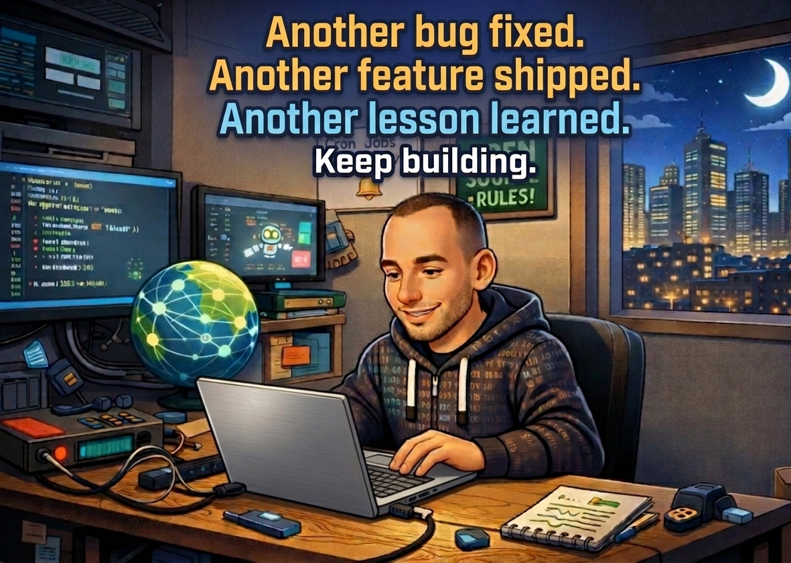

  

    

<h3 align="center">About me</h3>

  I'm an experienced security engineer, having worked for financial institutions and global companies.

  I've seen many cyber incidents and learned a lot about the challenges of the Windows environment.

  

  
  
  
  

   

  

 

---

 

  

  

 

---

 

 
     

  <picture>
    <source
      media="(prefers-color-scheme: dark)"
      srcset="https://raw.githubusercontent.com/mennylevinski/mennylevinski/main/dist/github-contribution-grid-snake-dark.svg" />
    <source
      media="(prefers-color-scheme: light)"
      srcset="https://raw.githubusercontent.com/mennylevinski/mennylevinski/main/dist/github-contribution-grid-snake.svg" />
    
  </picture>

